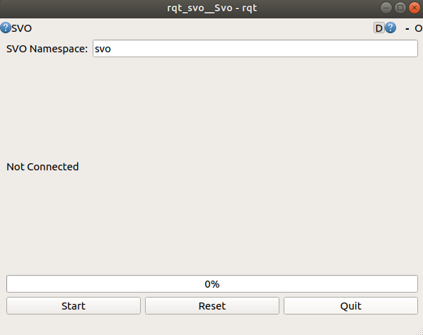
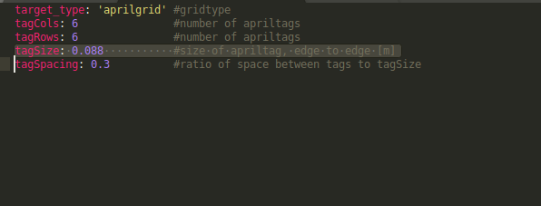
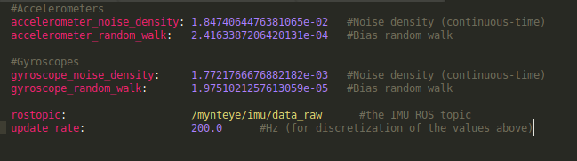
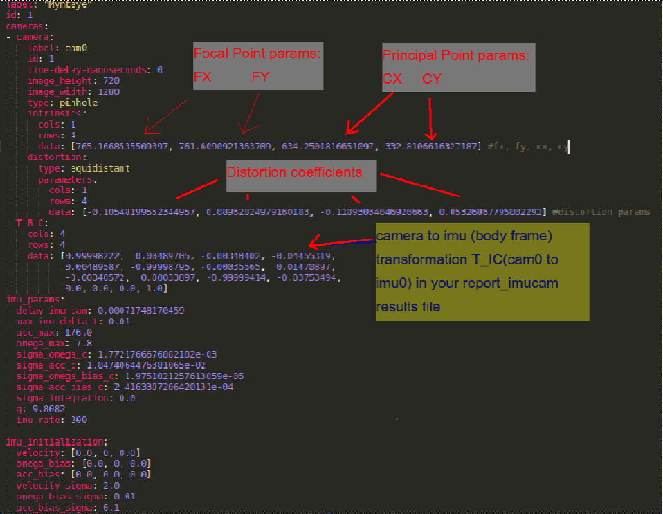
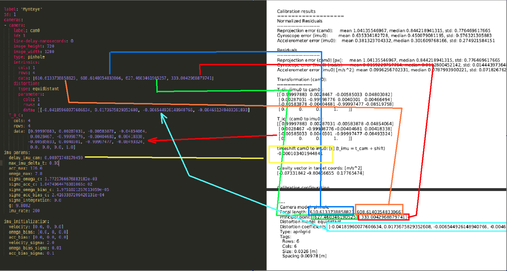
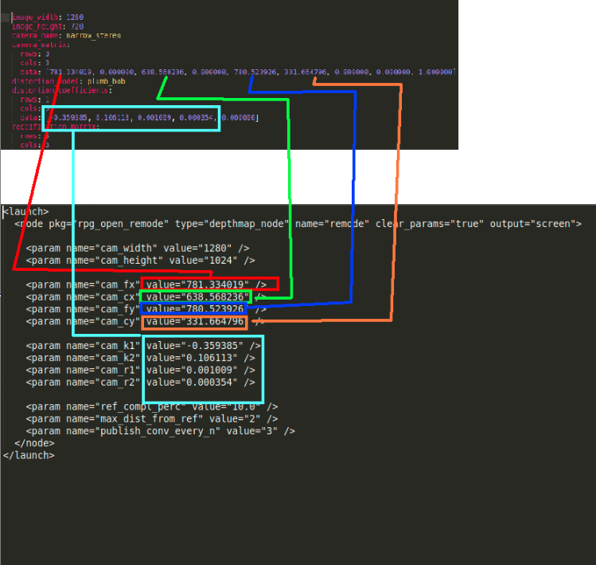

# 1.0 On the onboard (dji manifold) computer
## 1.1 Install the MyntEye camera driver and wrapper
#### 1.1.1 Install all of the dependencies first
```[required] sudo apt-get install cmake git libgtk2.0-dev pkg-config libavcodec-dev libavformat-dev libswscale-dev```

```[optional] sudo apt-get install python-dev python-numpy libtbb2 libtbb-dev libjpeg-dev libpng-dev libtiff-dev libjasper-dev libdc1394-22-dev```

#### 1.1.1 Link libGL.so for TX1/TX2 compile bug (Optional)
```sudo ln -sf /usr/lib/aarch64-linux-gnu/tegra/libGL.so /usr/lib/aarch64-linux-gnu/libGL.so ```
 
#### 1.1.2 Download the mynteye sdk
```cd ```
```git clone https://github.com/slightech/MYNT-EYE-D-SDK.git```
#### 1.1.3 change directory into the sdk folder
```cd MYNT-EYE-D-SDK```
#### 1.1.4 initialize build and compile
```make init```

```make all```

```sudo usermod -a -G video $USER```

#### 1.1.5 restart the onboard pc and run the ros driver for the mynt camera
```cd &&  source MYNT-EYE-D-SDK/wrappers/ros/devel/setup.bash```
### 1.2 Test your camera
#### 1.2.1 export your ros ip and launch the driver
```export ROS_IP=your_ip_address```
#### example
```export ROS_IP=192.168.1.35```
#### 1.2.2 launch the driver
```roslaunch mynteye_wrapper_d mynteye.launch```

# 2.0 On the Base Station
## 2.1 First install NVIDIA driver if you already have nvidia driver and cuda installed go to step 2.3:
### 2.1.1 add nvidia ppa:
```sudo add-apt-repository ppa:graphics-drivers/ppa```

### 2.1.2 install nvidia driver (I had 440 installed)
```sudo apt-get install nvidia-driver-440```
## 2.2 Install CUDA
### 2.2.1 make sure u delete existing cuda version like following
```sudo apt-get purge cuda```

```sudo apt-get purge libcudnn6```

```sudo apt-get purge libcudnn6-dev```

### 2.2.3 Download the appropriate CUDA version from theCUDA 11 Download Link
[download page](https://developer.nvidia.com/cuda-downloads?target_os=Linux&target_arch=x86_64&target_distro=Ubuntu&target_version=1804&target_type=deblocal) 

### 2.2.4 install following the instructions in the link above or steps below:
```wget https://developer.download.nvidia.com/compute/cuda/repos/ubuntu1804/x86_64/cuda-ubuntu1804.pin```

```sudo mv cuda-ubuntu1804.pin /etc/apt/preferences.d/cuda-repository-pin-600```

```wget http://developer.download.nvidia.com/compute/cuda/11.0.1/local_installers/cuda-repo-ubuntu1804-11-0-local_11.0.1-450.36.06-1_amd64.deb```

```sudo dpkg -i cuda-repo-ubuntu1804-11-0-local_11.0.1-450.36.06-1_amd64.deb```

```sudo apt-key add /var/cuda-repo-ubuntu1804-11-0-local/7fa2af80.pub```

```sudo apt-get update```

```sudo apt-get -y install cuda```

### 2.2.5 Restart your PC and run ‘nvidia-smi’ in the terminal
### you should see driver version top left and cuda version top right, additionally run ```nvcc --version``` you should see something like the following:
```nvcc --version```
```
nvcc: NVIDIA (R) Cuda compiler driver
Copyright (c) 2005-2019 NVIDIA Corporation
Built on Wed_Oct_23_19:24:38_PDT_2019
Cuda compilation tools, release 10.2, V10.2.89
```
## 2.3 Remode

###  2.3.1 Install REMODE dependencies REMODE_BUILD - except google test Install boost and eigen
```sudo apt-get install libopencv-dev libeigen3-dev libboost-filesystem-dev```
### 2.3.2 install sophus
```cd workspace```

```git clone https://github.com/strasdat/Sophus.git```

```cd Sophus```

```git checkout a621ff```

```mkdir build```

```cd build```

```cmake ..```

```make```
### 2.3.3 if errors occur:
### find - so2.cpp replace line 32-33 with 
```unit_complex_ = std::complex<double>(1,0);```
### from sophus folder: sudo ln -s se3.hpp se3.h    /usr/local/include/sophus 
### if no more errors occur: ‘sudo make install’
### 2.3.4 install catkin tools (preferred)
```sudo sh -c 'echo "deb http://packages.ros.org/ros/ubuntu `lsb_release -sc` main" > /etc/apt/sources.list.d/ros-latest.list'```

```wget http://packages.ros.org/ros.key -O - | sudo apt-key add -```

```sudo apt-get update```

```sudo apt-get install python-catkin-tools```


### 2.3.5 in your home folder: make svo_install_overlay_ws and src folder inside it cd into svo_install_overlay_ws/src and clone repos into them
``` mkdir svo_install_overlay_ws && cd svo_install_overlay_ws && mkdir src && cd src```

```git clone https://github.com/Asylbeck/rpg_svo_example.git```
### login: gduw
### pw: gdlsUW2020
```git checkout   ubuntu_18```
### 2.3.6 download the dependency libs and unzip run the script inside - it will copy some libs inside your ros libs folder so it will request sudo password

[svo_dependencies](https://drive.google.com/file/d/1Z3WQk3e8iNBW26tAgKbqfCEjDeCQlBPH/view?usp=sharing) 

```unzip svo_libs.zip```

```bash svo_libs_copy.sh```
### 2.3.7 Download regular binaries from: [zurich_svo_2_binaries](http://rpg.ifi.uzh.ch/svo2/svo_binaries_1604_kinetic.zip)
### unzip and copy svo_install_ws to your home folder:
```unzip svo_binaries_1604_kinetic.zip ```

```cd svo_binaries_1604_kinetic```

```cp -r svo_install_ws/  ~/```

```cd ~```

```cd svo_install_ws```

```./fix_path.sh```
#### (it may complain a bit but that’s ok)
```chmod 775 -R *```


### 2.3.8  inside svo_install_ws/install/ open _setup_util.py and on line 265 change ‘kinetic’ to ‘melodic’ if your ROS version is Melodic
```source ~/svo_install_ws/install/setup.bash```
### 2.3. 9 install catkin simple into ur catkin workspace
```cd ~/svo_install_overlay_ws/src/```
```git clone https://github.com/catkin/catkin_simple.git```

### 2.3.10 change directory to svo overlay workspace and build
```cd ~/svo_install_overlay_ws/```
#### ```catkin build``` or ```catkin_make``` if the catkin tools are not installed
### 2.3.11 source 
```source ~/svo_install_overlay_ws/devel/setup.bash```
### 2.3.12 launch svo
```roslaunch svo_ros mynteye_mono_imu.launch```

### 2.3.13 create a separate catkin worksapce for remode:
```cd ~/```

## 2.3.14 Download an build remode
### in you home folder make a folder remode_ws and a src folder inside of it, cd into src folder and clone remode:
```mkdir remode_ws && cd remode_ws && mkdir src && catkin build```

```git clone https://github.com/Asylbeck/rpg_open_remode.git```

### login: glow
### pw: gdlsUW2020
```git checkout ubuntu_1804_mynt```
### 2.3.15 change directory to one level up and build with ‘catkin_make’ or ‘catkin build’
### 2.3.16 if ```catkin simple``` package is missing then git clone this into your catkin workspace and rebuild
```git clone https://github.com/catkin/catkin_simple.git```
### 2.3.17 Launch REMODE and check for errors with CUDA 
```roslaunch rpg_open_remode mynteye.launch```
### 2.3.18 if no errors are reported then remode should show the cuda version and nvidia device being found
# 3.0 Test entire pipeline
### 3.1 start driver on the onboard PC
#### 3.1.1 follow steps 1.1.5 - 1.2.2 to start the driver and export ROS ip
#### 3.1.2 on base station PC for every terminal export your base station ip address and set ROS master ip as the onboard PC's ip address
```export ROS_IP=base-station-ip```

```export ROS_MASTER_URI=http://onbaord-pc-ip```

#### 3.1.3 start the image transport to convert compressed messages to raw
```rosrun image_transport republish compressed in:=/mynteye/left/image_color out:=/myntcolor```

#### 3.14 source svo and launch
```source ~/svo_install_overlay_ws/devel/setup.bash```

#### 3.15 launch svo
```roslaunch svo_ros roslaunch svo_ros mynteye_mono_imu.launch```
#### 3.1.6 source and launch remode
```source ~/remode_ws/devel/setup.bash```

```roslaunch rpg_open_remode mynteye.launch```
#### 3.1.7 in the RVIZ window you should be able to see the SVO trajectory and after the remode starts publishing dense pointcloud
#### 3.1.8 if the svo loses track click on the svo's rqt gui click on reset and start, make sure the namespace is svo



# 4.0 Calibration
#### If calibration is needed, kalibr can be used 
#### 4.1.1 create a directory for kalibr workspace and initialize it
```cd && mkdir kalibr_ws && cd kalibr_ws && mkdir src && catkin build```
#### 4.1.2 go into source folder of the kalibr workspace and clone kalibr package into it and then build it
```cd ~/kalibr_ws/```

```git clone https://github.com/ethz-asl/kalibr.git```

```catkin build```

#### 4.1.3 follow steps 1.1.5 to 1.2.2 if you need to install the MyntEye driver

#### 4.1.4 print out the [april tag](https://drive.google.com/file/d/0B0T1sizOvRsUdjFJem9mQXdiMTQ/edit)  and record the bag by following the guide [in this video](https://m.youtube.com/watch?v=puNXsnrYWTY) and using the example command below:

```rosbag record /mynteye/left/image_color /mynteye/imu/data_raw```

#### 4.1.5 measure the square size and gap size on you april tag download [this file](https://drive.google.com/file/d/0B0T1sizOvRsUU2lGMTdWYWhPaWc/edit) and change the value for tag size in meters and verify that the ration between the tag size and gap size 0.3

 

#### 4.1.6 download the [imu param file](https://drive.google.com/file/d/0B0T1sizOvRsUSk9ReDlid0VSY3M/edit)  and fill it as following:

 

```
#Accelerometers                                      
accelerometer_noise_density: 1.8474064476381065e-02  
accelerometer_random_walk:   2.4163387206420131e-04  
                                                     
#Gyroscopes                                          
gyroscope_noise_density:     1.7721766676882182e-03  
gyroscope_random_walk:       1.9751021257613059e-05  
                                                     
rostopic:                    /mynteye/imu/data_raw   
update_rate:                 200.0                   
```

### 4.1.7 start camera caliration using the recorded bag and apriltag param file
```cd && cd kalibr_ws/devel/bin```

```./kalibr_calibrate_cameras --target path-to-apriltag-paramfile  --bag path-to-calibration-bag --models pinhole-equi --topics /mynteye/left/image_color --approx-sync 0.0001```
##### *this use the /mynteye/left/image_color topic - left camera color image for calibration
##### example:
```./kalibr_calibrate_cameras --target /home/user/april_6x6.yaml --bag ~/bags/calibration/2020-02-17-21-21-04.bag --models pinhole-equi --topics /camera0/image_color --approx-sync 0.0001```

#### 4.1.8 using the generated camchain file, imu param file and apriltag param file perform the camera-to-imu calibration
```./kalibr_calibrate_imu_camera --target  path-to-apriltag-paramfile --bag path-to-calibration-bag --cam path-to-camchain-file --imu path-to-imu-param-file```

##### example:
```./kalibr_calibrate_imu_camera --target /home/user/april_6x6.yaml --bag~/bags/calibration/2020-02-17-21-21-04.bag --cam ~/Documents/feb_16_calibration_kalibr/camchain-homeuwbasebagscali_feb_162020-02-17-21-21-04.yaml --imu path-to-imu-param-file```

#### 4.1.9 use the generated pdf calibration files that starts with ```report-imucam-...``` to change the calibration file inside ~/svo_install_overlay_ws/src/rpg_svo_example/rpg_svo_example/svo_ros/calib/ folder


 
#### 4.1.10 make sure that you use the new calibration file inside the launch file you are about to launch
 
### 4.2.0 use ros camera calibration tool for remode:
#### 4.2.1 print out the [checkerboard pattern ](http://wiki.ros.org/camera_calibration/Tutorials/MonocularCalibration?action=AttachFile&do=view&target=check-108.pdf)  and measure the square size, camera calibration tool needs two parameters: camera topic and square size.  Below is the example for a left camera of mynteye and a square of size 0.108 meters
```rosrun camera_calibration cameracalibrator.py --size 8x6 --square 0.108 image:=/mynteye/left/image_color```
#### 4.2.1 move the camera up and down, side to side away and towards the board and at different angles until all of the bars are filled and are green; when ready hit calibrate button
#### 4.2.2 open tmp folder in home directory and check ost.yaml file and fill the corresponding fields in the remode launch file:
 
